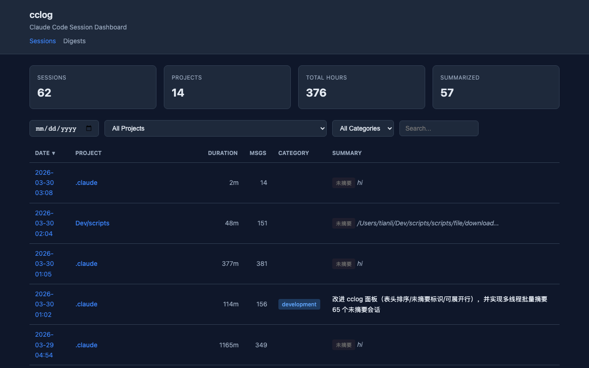

# cclog

**English** | [中文](README_CN.md)

Browse, summarize, and review your [Claude Code](https://claude.ai/code) sessions from the terminal.

[](https://pypi.org/project/cclog/)
[](https://python.org)
[](LICENSE)

---

## What can cclog do?

| Command | What it does |
|---------|-------------|
| `cclog index` | Scan and index all Claude Code sessions into a local DB |
| `cclog list` | List sessions — filter by project, date, category |
| `cclog show <id>` | Full details for one session (tokens, tools used, files changed) |
| `cclog stats` | Aggregate stats: total hours, tokens, projects |
| `cclog summarize` | AI-generated summaries, categories, and learnings per session |
| `cclog digest` | Daily or weekly Markdown digest of your sessions |
| `cclog clean` | Find and remove junk/empty sessions (dry-run by default) |
| `cclog delete <id>` | Delete a single session from index and disk |
| `cclog site` | Generate a browsable static HTML site of all sessions |



---

## Install

```bash
pip install cclog
```

## Quick Start

```bash
# Index your sessions (run once, then after new sessions)
cclog index

# See what you worked on today
cclog list --date 2026-03-30

# Deep-dive into a session
cclog show abc123

# Weekly summary
cclog stats
cclog digest --week

# Let AI summarize your last 10 sessions
cclog summarize --limit 10

# Browse everything in a browser
cclog site --open
```

## Example output

```
$ cclog stats
=== cclog Statistics ===

  Sessions:     142
  Projects:     18
  Summarized:   87
  Total time:   63.4 hours
  Input tokens:  12.3M
  Output tokens: 4.1M
  Date range:   2026-01-05 ~ 2026-03-30
```

## Use cases

- **Daily standup prep** — `cclog digest` gives you a Markdown summary of yesterday's sessions
- **Weekly review** — `cclog digest --week` shows what you shipped this week
- **Cost tracking** — `cclog stats` shows total token usage across all projects
- **Session cleanup** — `cclog clean` removes accidental 1-minute throwaway sessions
- **Knowledge base** — `cclog summarize` + `cclog site` turns sessions into a searchable archive

## Requirements

- Python 3.11+
- [Claude Code](https://claude.ai/code) installed (provides session data)

## License

MIT
