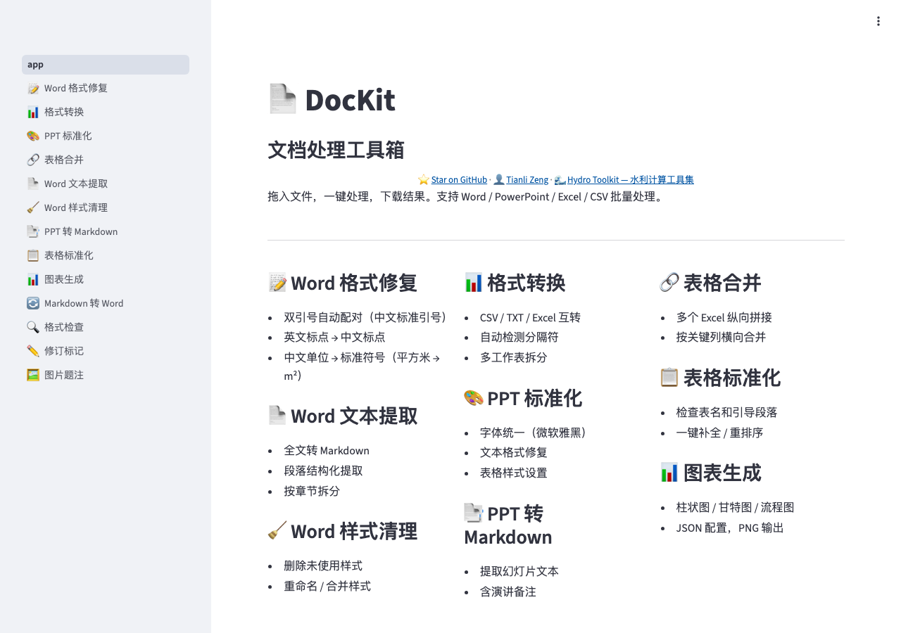

# DocKit

**English** | [中文](README_CN.md)

Document processing toolkit for Word, PowerPoint, Excel, and CSV files.

**Bytes in, bytes out.** Pure processing logic with no file I/O assumptions — use it from CLI scripts, web apps, or any Python program.

[](https://dockit.tianlizeng.cloud)
[](LICENSE)
[](https://python.org)

---

### Try it now — no install needed

**https://dockit.tianlizeng.cloud**

Upload your document, pick a tool, download the result. Zero setup.



---

## What can DocKit do?

| Tool | What it does | Input | Output |
|------|-------------|-------|--------|
| **Word Format Fix** | Fix quotes, punctuation, units in `.docx` | Word file | Word file |
| **Word Text Extract** | Full text extraction to Markdown | Word file | Markdown |
| **Word Style Cleanup** | Remove unused styles, rename/merge styles | Word file | Word file |
| **Format Convert** | Convert between XLSX, CSV, TXT | Spreadsheet | Spreadsheet |
| **PPT Standardize** | Unify fonts, fix text, set table styles | PowerPoint | PowerPoint |
| **PPT to Markdown** | Extract slide text with speaker notes | PowerPoint | Markdown |
| **Table Merge** | Merge multiple spreadsheets by column matching | Excel files | Excel file |
| **Table Standardize** | Check headers, reorder, auto-complete | Excel file | Excel file |
| **Chart Generation** | Bar charts, Gantt charts, flow diagrams | JSON config | PNG |
| **Markdown to Word** | Convert Markdown to styled Word document | Markdown | Word file |
| **Format Inspection** | Inspect document structure and styles | Word file | Report |
| **Revision Marks** | Add revision marks to Word documents | Word file | Word file |
| **Image Captions** | Add captions to images in Word documents | Word file | Word file |

## Install

```bash
# From GitHub (recommended)
pip install git+https://github.com/zengtianli/dockit.git

# For local development
git clone https://github.com/zengtianli/dockit.git
cd dockit && pip install -e .
```

## Quick Start

```python
from dockit.docx import format_text

with open("input.docx", "rb") as f:
    doc_bytes = f.read()

result = format_text(doc_bytes, fix_quotes=True, fix_punctuation=True, fix_units=True)

with open("output.docx", "wb") as f:
    f.write(result.data)

print(result.stats)  # {"quotes": 5, "punctuation": 12, "units": 3}
```

## Features

### Text Formatting (`dockit.text`)
- Fix quote pairing (smart Chinese quotes)
- Convert English punctuation to Chinese equivalents
- Convert Chinese unit names to standard symbols (e.g. 平方米 → m²)

### Word Processing (`dockit.docx`)
- Format text in Word documents (quotes, punctuation, units)
- Quote font splitting (set specific font for quote characters)
- Process paragraphs, tables, headers, and footers

### PowerPoint Processing (`dockit.pptx`)
- Unify fonts across all slides and masters
- Fix text formatting (quotes, punctuation, units)
- Set table style options (header row, banded rows, first column)
- One-click standardization (all of the above)

### Excel Processing (`dockit.xlsx`)
- Convert between XLSX, CSV, and TXT formats
- Split workbook into per-sheet files
- Lowercase column headers
- Convert legacy .xls to .xlsx

### CSV Processing (`dockit.csv`)
- Auto-detect delimiters
- Convert between CSV and delimited text
- Replace circled numbers with plain format
- Reorder rows by a reference list

## Self-host

Run your own instance with Docker or directly:

```bash
# Docker
docker build -t dockit .
docker run -p 8503:8503 dockit

# Or run directly
pip install -e .[web]
streamlit run app/app.py
```

Or just use the hosted version: **https://dockit.tianlizeng.cloud**

## License

MIT
