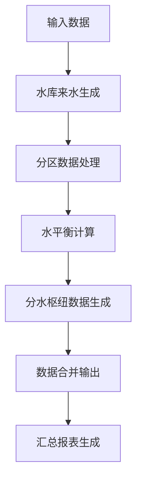
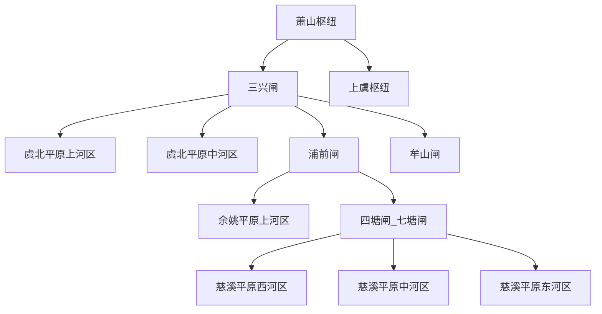

# 浙东河区调度模型

## 1. 系统概述

### 1.1 项目背景

浙东河区调度模型是一个专业的水资源管理系统，用于计算和优化浙江东部地区各河区的水资源调度方案。通过复杂的水平衡计算，为各河区提供科学的水资源配置建议。

### 1.2 覆盖范围

- **19个河区**：余姚平原、慈溪平原、绍虞平原、虞北平原、蜀山平原等
- **6个分水枢纽**：三兴闸、上虞枢纽、四塘闸/七塘闸、浦前闸、牟山闸、萧山枢纽
- **时间精度**：逐日计算
- **数据单位**：万立方米(万m³)、米(m)、立方米每秒(m³/s)

## 2. 系统架构

### 2.1 数据流转架构



### 2.2 核心组件

| 组件名称 | 主要功能 | 关键特性 |
|----------|----------|----------|
| **ConfigManager** | 配置管理 | 库容曲线、分水枢纽规则、水位数据 |
| **DataLoader** | 数据加载 | 制表符分隔文件、缓存机制、插值函数 |
| **ReservoirInflowGenerator** | 水库来水生成 | 根据河区包含水库汇总计算来水量 |
| **DistrictDataProcessor** | 分区数据处理 | 需水和来水数据分类处理 |
| **WaterBalanceCalculator** | 水平衡计算 | 核心的日水平衡计算逻辑 |
| **FSSnDataGenerator** | 分水枢纽数据生成 | 多级嵌套枢纽结构处理 |

## 3. 核心功能

### 3.1 水平衡计算

- **净流量计算**：净流量 = 合计来水 - 总需水量
- **容积调度**：日末容积 = 日初容积 + 容积变化
- **排水控制**：河区排水 = MAX(0, 日末容积 - 排水容积)
- **缺水评估**：缺水(浙东需供) = MAX(0, 总需水量 - 合计来水)

### 3.2 分水枢纽调度

#### 枢纽层级结构



#### 调度计算逻辑

- **数据汇总**：枢纽引水量 = 所有管辖分区的"缺水(浙东需供)"之和
- **递归处理**：自动展开多级嵌套枢纽的所有叶子节点分区
- **流量转换**：日引水量(万m³) ÷ 8.64 = 日均引水流量(m³/s)

### 3.3 数据处理流程

1. **配置初始化**：加载库容曲线、分水枢纽规则等静态配置
2. **水库来水生成**：根据各分区的水库配置，汇总计算来水量
3. **分区数据处理**：分别处理每个河区的需水和来水数据
4. **水平衡计算**：执行复杂的日水平衡计算
5. **枢纽数据生成**：计算各枢纽的引水需求
6. **数据输出**：合并结果并生成标准格式报表

## 4. 关键概念

### 4.1 水平衡计算原理

#### 核心计算公式

```text
净流量 = 合计来水 - 总需水量
日末容积 = 日初容积 + 净流量
河区排水 = MAX(0, 日末容积 - 排水容积)
排末容积 = 日末容积 - 河区排水
缺水(浙东需供) = MAX(0, 总需水量 - 合计来水)
```

#### 水位-容积转换
系统使用插值函数实现水位与容积的双向转换，基于`static_HQ_ZQ.txt`的库容曲线数据。

### 4.2 字段计算逻辑

#### 来水数据字段

| 字段 | 数据源 | 计算方式 | 纳入合计来水 |
|------|--------|----------|-------------|
| **平原产水** | `input_GPS_PYCS.txt` | 直接读取 | ❌ 否 |
| **其他外供** | `input_LS_QT.txt` | 直接读取 | ✅ 是 |
| **河网供水** | `input_FQJL.txt` | 直接读取 | ✅ 是 |
| **水库供水** | 基于`static_HQ_SK.txt`从`input_SK.txt`汇总 | 各水库数据求和 | ✅ 是 |

#### 需水数据字段

| 字段 | 数据源 | 计算方式 |
|------|--------|----------|
| **农业需水** | `input_GPS_GGXS.txt` | 直接读取 |
| **其他生态需水** | `input_XS_ST.txt` | 直接读取 |
| **非农需水** | `input_XS_FN.txt` | 直接读取 |
| **总需水量** | 计算字段 | 农业需水 + 非农需水 + 生态需水 |

#### 容积和调度字段

| 字段 | 计算方式 | 业务含义 |
|------|----------|----------|
| **目标容积** | 目标水位→库容曲线转换 | 理想的蓄水目标 |
| **日初容积** | 第1天：当前水位转换\n后续：前日排末容积 | 每日开始时的蓄水量 |
| **日末容积** | 日初容积 + 容积变化 | 排水前的容积 |
| **河区排水** | MAX(0, 日末容积 - 排水容积) | 超出排水位时的排水量 |
| **排末容积** | 日末容积 - 河区排水 | 排水后的最终容积 |

## 5. 数据接口

### 5.1 输入数据格式

#### 静态配置文件

- **static_HQ_ZQ.txt**：河区库容曲线数据
- **static_HQ_SK.txt**：河区水库配置关系
- **static_SW_PS.txt**：各河区排水位设定
- **static_FSSN_RULES.txt**：分水枢纽管辖规则

#### 时间序列数据文件

```text
日期    河区1    河区2    河区3    ...
2024-01-01    100.5    200.3    150.8
2024-01-02    110.2    195.7    148.9
```

主要时间序列文件：

- **input_SK.txt**：水库来水数据
- **input_SW_CS.txt**：当前水位数据
- **input_SW_MB.txt**：目标水位数据
- **input_FQJL.txt**：河网供水数据
- **input_GPS_GGXS.txt**：农业需水数据

### 5.2 输出报表体系

#### 河区数据文件 (`output_hq_*.txt`)

包含31个核心字段的完整水平衡计算结果：
- 来水数据：平原产水、其他外供、河网供水、水库供水
- 需水数据：农业需水、生态需水、非农需水
- 调度数据：容积变化、排水量、缺水量、纳蓄能力等

#### 分水枢纽数据文件 (`output_sn_*.txt`)

- 各分区的缺水(浙东需供)明细
- 日引水量(万m³)
- 日均引水流量(m³/s)

#### 汇总统计文件

- **output_hq_all.txt**：所有河区的逐日数据汇总
- **output_hq_all_cumulative.txt**：累积汇总数据
- **output_hq_all_total.txt**：整个计算期间的总体统计

## 6. 应用价值

### 6.1 水资源优化配置

- 科学计算各河区的水资源供需平衡
- 优化分水枢纽的调度策略
- 提供精确的缺水预警和补给建议

### 6.2 防洪调度支持

- 实时监控各河区的蓄水容积变化
- 自动计算排水需求和排水时机
- 确保河区水位控制在安全范围内

### 6.3 决策支持分析

- 生成多维度的统计报表和趋势分析
- 支持不同调度方案的效果对比
- 为水资源管理决策提供数据支撑

## 7. 使用指南

### 7.1 运行方法

```bash
# 使用当前目录作为工作目录
python main.py

# 指定工作目录
python main.py /path/to/working/directory
```

### 7.2 配置说明

#### 文件要求
- **文件编码**：所有输入文件必须使用UTF-8编码
- **分隔符**：使用制表符(`\t`)作为字段分隔符
- **日期格式**：建议使用标准格式如 `2024-01-01`

#### 数据完整性要求
- 确保所有河区在各个输入文件中都有对应的数据列
- 所有时间序列文件的日期范围和格式必须保持一致
- 静态配置文件中的河区名称必须与数据文件中的列名完全一致

### 7.3 项目结构

```text
project/
├── main.py                     # 主程序文件
├── data/                       # 数据处理目录
│   ├── 01_inflow/             # 来水数据输出
│   ├── 02_demand/             # 需水数据输出
│   ├── 03_calculated/         # 水平衡计算结果
│   ├── 04_final/              # 最终合并数据
│   ├── 05_district/           # 分区汇总数据
│   └── fssn_data/             # 分水枢纽临时数据
├── static_*.txt               # 静态配置文件
├── input_*.txt                # 输入数据文件
└── output_*.txt               # 输出结果文件
```

### 7.4 常见问题解决

| 问题类型 | 解决方案 |
|----------|----------|
| **文件未找到** | 检查输入文件是否存在且路径正确 |
| **编码错误** | 确保所有文件使用UTF-8编码保存 |
| **列名不匹配** | 检查配置文件中的河区名称与数据文件列名是否一致 |
| **数据格式错误** | 检查数值列是否包含非数字字符 |

---

---

浙东河区调度模型 - 为水资源科学调度提供专业计算支持
