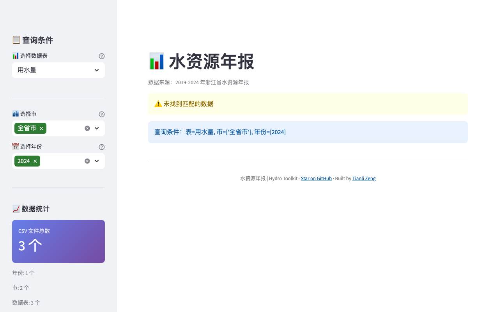

# hydro-annual

**English** | [中文](README_CN.md)

Query and export Zhejiang Province water resources annual reports from 2019 to 2024.

[](https://hydro-annual.tianlizeng.cloud)
[](https://python.org)
[](LICENSE)

---

### Try it now — no install needed

**https://hydro-annual.tianlizeng.cloud**

---



---

## What can hydro-annual do?

| Feature | Description |
|---------|-------------|
| **Multi-year coverage** | Browse water resource data from 2019 to 2024 |
| **City-level filter** | Filter by prefecture-level city across Zhejiang |
| **Category selection** | Choose specific report categories for targeted queries |
| **Export Excel / CSV** | Download filtered results in your preferred format |
| **Pre-loaded dataset** | No file upload needed — data is built in |

## Install

```bash
git clone https://github.com/zengtianli/hydro-annual.git
cd hydro-annual
pip install -r requirements.txt
```

## Quick Start

```bash
streamlit run app.py
```

## Self-host

```bash
git clone https://github.com/zengtianli/hydro-annual.git
cd hydro-annual
pip install -r requirements.txt
streamlit run app.py
```

Or use the hosted version: **https://hydro-annual.tianlizeng.cloud**

## Requirements

- Python 3.9+
- Streamlit 1.36+

## License

MIT
