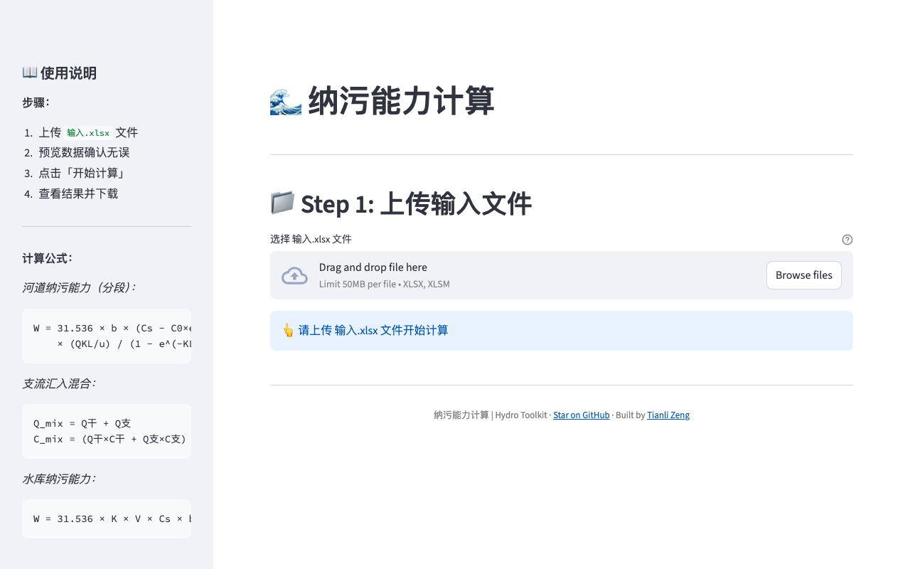

# hydro-capacity

[English](README.md) | **中文**

河流与水库纳污能力计算工具——多方案情景、支流分段建模。

[](https://hydro-capacity.tianlizeng.cloud)
[](https://python.org)
[](LICENSE)

---

### 无需安装，立即体验

**https://hydro-capacity.tianlizeng.cloud**

---



---

## 功能一览

| 功能 | 说明 |
|------|------|
| **多方案情景** | 并排模拟多个污染情景 |
| **支流分段** | 每条支流独立参数设置 |
| **逐月计算** | 结合月径流数据体现季节变化 |
| **Excel 输入/输出** | 上传参数，下载纳污能力结果 |
| **内置样例数据** | 含开箱即用的示例数据集 |

## 安装

```bash
git clone https://github.com/zengtianli/hydro-capacity.git
cd hydro-capacity
pip install -r requirements.txt
```

## 快速开始

```bash
streamlit run app.py
```

## 自托管

```bash
git clone https://github.com/zengtianli/hydro-capacity.git
cd hydro-capacity
pip install -r requirements.txt
streamlit run app.py
```

或直接使用托管版本：**https://hydro-capacity.tianlizeng.cloud**

## 环境要求

- Python 3.9+
- Streamlit 1.36+

## License

MIT
