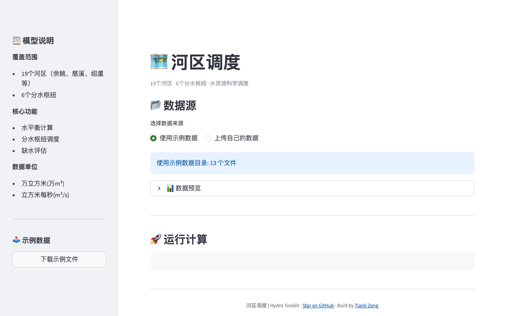

# hydro-district

**English** | [中文](README_CN.md)

Daily water supply-demand scheduling across 19 river districts with reservoir and sluice gate management.

[](https://hydro-district.tianlizeng.cloud)
[](https://python.org)
[](LICENSE)

---

### Try it now — no install needed

**https://hydro-district.tianlizeng.cloud**

---



---

## What can hydro-district do?

| Feature | Description |
|---------|-------------|
| **19-district model** | Individual parameters per district for accurate local scheduling |
| **Daily scheduling** | Day-by-day supply-demand balance with operations log |
| **Reservoir & sluice control** | Manage inflow, outflow, gate operations per timestep |
| **Batch import/export** | ZIP-based multi-district data workflow |
| **Result browser** | Built-in viewer for district-specific outputs |

## Install

```bash
git clone https://github.com/zengtianli/hydro-district.git
cd hydro-district
pip install -r requirements.txt
```

## Quick Start

```bash
streamlit run app.py
```

## Self-host

```bash
git clone https://github.com/zengtianli/hydro-district.git
cd hydro-district
pip install -r requirements.txt
streamlit run app.py
```

Or use the hosted version: **https://hydro-district.tianlizeng.cloud**

## Requirements

- Python 3.9+
- Streamlit 1.36+

## License

MIT
