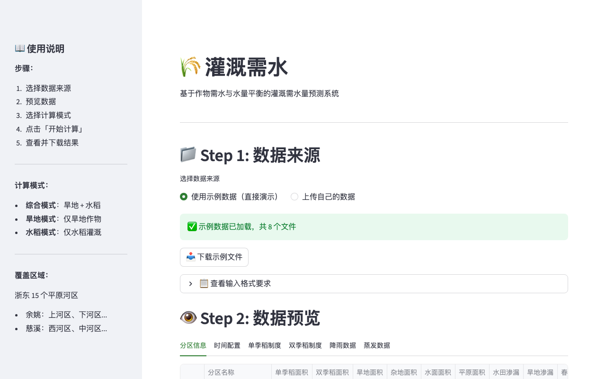

# hydro-irrigation

[English](README.md) | **中文**

农业灌溉逐日水量平衡模型——水稻与旱作物独立计算。

[](https://hydro-irrigation.tianlizeng.cloud)
[](https://python.org)
[](LICENSE)

---

### 无需安装，立即体验

**https://hydro-irrigation.tianlizeng.cloud**

---



---

## 功能一览

| 功能 | 说明 |
|------|------|
| **水稻水量平衡** | 逐日水稻灌溉需水量，追踪田间水深 |
| **旱作物模型** | 非水稻作物独立土壤水分平衡 |
| **多分区支持** | 单次运行处理多个灌区 |
| **ZIP 批量处理** | 将多个输入文件打包上传 |
| **Excel 导出** | 含逐日灌溉计划的分区结果 |

## 安装

```bash
git clone https://github.com/zengtianli/hydro-irrigation.git
cd hydro-irrigation
pip install -r requirements.txt
```

## 快速开始

```bash
streamlit run app.py
```

## 自托管

```bash
git clone https://github.com/zengtianli/hydro-irrigation.git
cd hydro-irrigation
pip install -r requirements.txt
streamlit run app.py
```

或直接使用托管版本：**https://hydro-irrigation.tianlizeng.cloud**

## 环境要求

- Python 3.9+
- Streamlit 1.36+

## License

MIT
