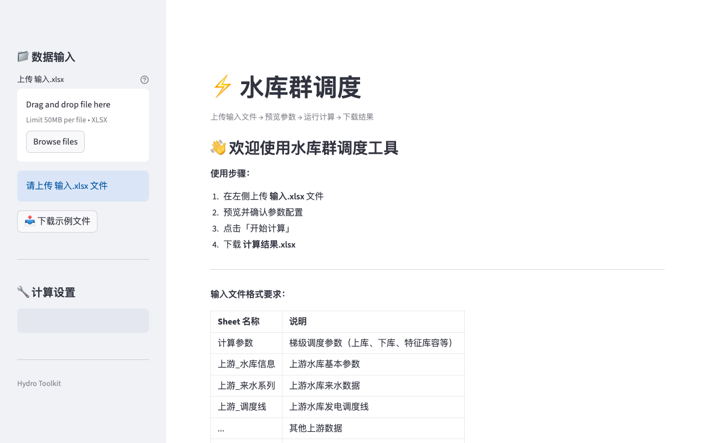

# hydro-reservoir

[English](README.md) | **中文**

梯级水库水电优化调度工具，内置 Plotly 交互式可视化图表。

[](https://hydro-reservoir.tianlizeng.cloud)
[](https://python.org)
[](LICENSE)

---

### 无需安装，立即体验

**https://hydro-reservoir.tianlizeng.cloud**

---



---

## 功能一览

| 功能 | 说明 |
|------|------|
| **梯级联合调度** | 对串联多库进行联合优化 |
| **灵活时步** | 逐日、旬或月计算时段 |
| **交互式图表** | Plotly 可视化水位、流量和出力 |
| **参数预览** | 运行优化前查看水库参数 |
| **Excel 输入/输出** | 上传输入工作簿，下载调度结果 |

## 安装

```bash
git clone https://github.com/zengtianli/hydro-reservoir.git
cd hydro-reservoir
pip install -r requirements.txt
```

## 快速开始

```bash
streamlit run app.py
```

## 自托管

```bash
git clone https://github.com/zengtianli/hydro-reservoir.git
cd hydro-reservoir
pip install -r requirements.txt
streamlit run app.py
```

或直接使用托管版本：**https://hydro-reservoir.tianlizeng.cloud**

## 环境要求

- Python 3.9+
- Streamlit 1.36+

## License

MIT
