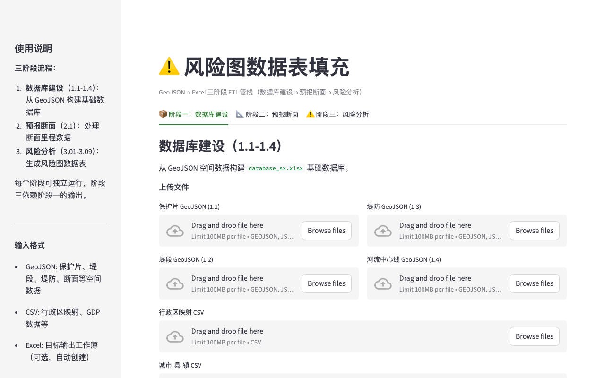

# hydro-risk

[English](README.md) | **中文**

三阶段 ETL 流水线——将 GeoJSON 水文数据转换为结构化 Excel 风险评估工作簿。

[](https://python.org)
[](LICENSE)

---



---

## 功能一览

| 功能 | 说明 |
|------|------|
| **第一阶段 — 建库** | 从 GeoJSON 特征中提取并规范化基础表 |
| **第二阶段 — 预测** | 应用水力模型生成预测数据 |
| **第三阶段 — 风险分析** | 计算风险评分，生成 18+ 工作表的工作簿 |
| **14 个处理脚本** | 模块化流水线，每步可独立运行 |
| **自动编码生成** | 生成查找代码并规范化空间数据 |

## 安装

```bash
git clone https://github.com/zengtianli/hydro-risk.git
cd hydro-risk
pip install -r requirements.txt
```

## 快速开始

```bash
streamlit run app.py
```

## 环境要求

- Python 3.9+
- Streamlit 1.36+

## License

MIT
