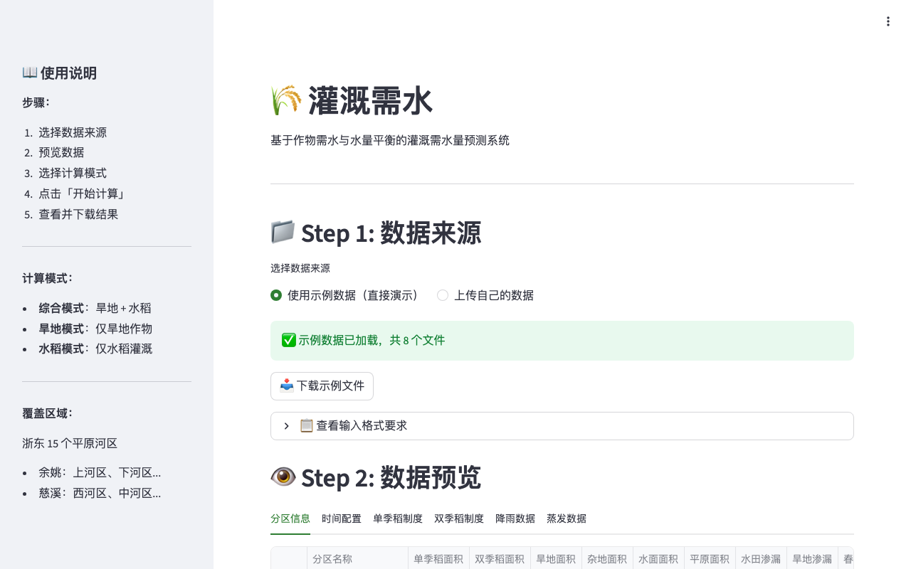
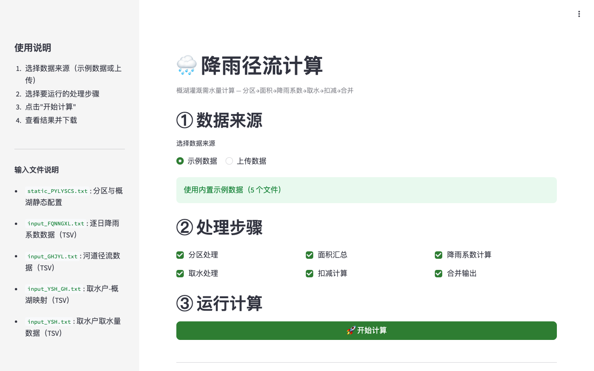
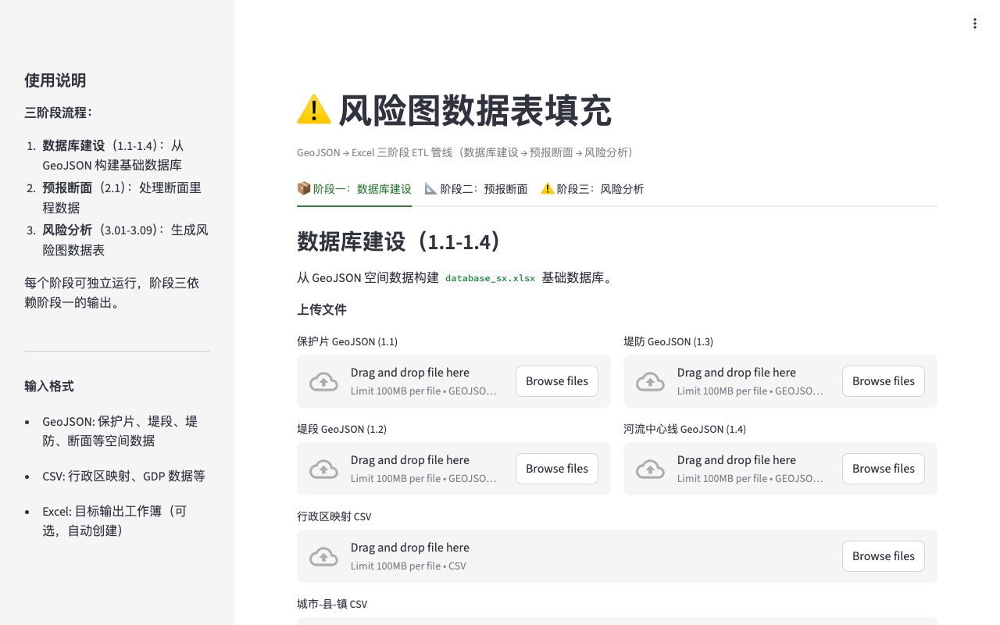

# 🌊 Hydro Toolkit

[English](README.md) | **中文**

水利计算工具集 — 水库调度、纳污能力、灌溉需水、水效评估等一站式计算平台。

[](https://hydro.tianlizeng.cloud)
[](LICENSE)
[](https://python.org)

---

### 立即体验 — 无需安装

| 全部工具 | 或单独使用每个工具 |
|:---:|:---:|
| **https://hydro.tianlizeng.cloud** | 见下方表格链接 |

上传数据 → 选择工具 → 下载结果。所有工具内置示例数据，零门槛试用。

---

## 功能一览

| 工具 | 功能 | 输入 | 输出 | 在线体验 |
|------|------|------|------|----------|
| **纳污能力计算** | 河道/水库纳污能力计算，支持支流分段和多方案 | Excel (流量 + 功能区参数) | Excel (逐月纳污能力) | [演示](https://hydro-capacity.tianlizeng.cloud) |
| **水库群调度** | 梯级水库发电调度优化计算 | Excel (来水 + 水库参数) | Excel (逐日调度过程) | [演示](https://hydro-reservoir.tianlizeng.cloud) |
| **水效评估** | 工业集聚区水效评估 (AHP+CRITIC+TOPSIS) | Excel (三循环指标数据) | Excel (评分 + 企业排名) | [演示](https://hydro-efficiency.tianlizeng.cloud) |
| **水资源年报** | 浙江省水资源年报数据查询 (2019-2024) | 内置 CSV 数据集 | Excel/CSV 导出 | [演示](https://hydro-annual.tianlizeng.cloud) |
| **灌溉需水** | 水稻+旱地灌溉需水量水平衡模拟 | TXT (降雨 + 蒸发) | Excel (逐日需水量) | [演示](https://hydro-irrigation.tianlizeng.cloud) |
| **河区调度** | 19河区逐日水资源供需平衡调度 | TXT (来水 + 需水) | TXT/ZIP (调度结果) | [演示](https://hydro-district.tianlizeng.cloud) |
| **地理编码** | 批量地理编码/逆编码（高德 API） | Excel (坐标/地址) | Excel (结果) | [演示](https://hydro-geocode.tianlizeng.cloud) |
| **降雨径流** | 概湖灌溉需水量计算（6步管线） | TXT (降雨 + 径流) | CSV (逐时需水) | [演示](https://hydro-rainfall.tianlizeng.cloud) |
| **风险图数据** | 风险图数据表自动填充（GeoJSON→Excel ETL） | GeoJSON + CSV | Excel (18+ sheets) | [演示](https://hydro-risk.tianlizeng.cloud) |

## 截图

### 首页


### 工具界面
| | |
|---|---|
|  |  |
|  |  |
|  |  |
|  |  |
|  | |

## 插件架构

```
hydro-toolkit（宿主壳）        插件（git clone 安装）
┌─────────────────┐     ┌──────────────────────┐
│  app.py         │     │  hydro-capacity/     │
│  core/          │────▶│  hydro-reservoir/    │
│  plugins/       │     │  hydro-efficiency/   │
│    hydro-xxx/   │     │  hydro-annual/       │
│    hydro-yyy/   │     │  hydro-irrigation/   │
└─────────────────┘     │  hydro-district/     │
                        └──────────────────────┘
```

Toolkit 是**纯宿主壳**，不含任何业务逻辑。每个工具都是独立插件，通过 `plugin.yaml` 在运行时发现。既可以在 Toolkit 中使用，也可以独立运行。

| 插件 | 功能 | 仓库 | 独立演示 |
|------|------|------|----------|
| 🌊 纳污能力计算 | 河道/水库纳污能力计算 | [hydro-capacity](https://github.com/zengtianli/hydro-capacity) | [hydro-capacity.tianlizeng.cloud](https://hydro-capacity.tianlizeng.cloud) |
| ⚡ 水库群调度 | 梯级水库水电调度优化 | [hydro-reservoir](https://github.com/zengtianli/hydro-reservoir) | [hydro-reservoir.tianlizeng.cloud](https://hydro-reservoir.tianlizeng.cloud) |
| 💧 水效评估 | AHP+CRITIC+TOPSIS 评价 | [hydro-efficiency](https://github.com/zengtianli/hydro-efficiency) | [hydro-efficiency.tianlizeng.cloud](https://hydro-efficiency.tianlizeng.cloud) |
| 📊 水资源年报 | 浙江省数据查询 (2019–2024) | [hydro-annual](https://github.com/zengtianli/hydro-annual) | [hydro-annual.tianlizeng.cloud](https://hydro-annual.tianlizeng.cloud) |
| 🌾 灌溉需水 | 水稻+旱地水平衡模型 | [hydro-irrigation](https://github.com/zengtianli/hydro-irrigation) | [hydro-irrigation.tianlizeng.cloud](https://hydro-irrigation.tianlizeng.cloud) |
| 🗺️ 河区调度 | 19河区逐日供需平衡 | [hydro-district](https://github.com/zengtianli/hydro-district) | [hydro-district.tianlizeng.cloud](https://hydro-district.tianlizeng.cloud) |
| 📍 地理编码 | 批量地理编码/逆编码（高德 API） | [hydro-geocode](https://github.com/zengtianli/hydro-geocode) | [hydro-geocode.tianlizeng.cloud](https://hydro-geocode.tianlizeng.cloud) |
| 🌧️ 降雨径流 | 概湖灌溉需水量计算 | [hydro-rainfall](https://github.com/zengtianli/hydro-rainfall) | [hydro-rainfall.tianlizeng.cloud](https://hydro-rainfall.tianlizeng.cloud) |
| ⚠️ 风险图数据 | 风险图数据表自动填充 ETL | [hydro-risk](https://github.com/zengtianli/hydro-risk) | [hydro-risk.tianlizeng.cloud](https://hydro-risk.tianlizeng.cloud) |

## 快速开始

```bash
git clone https://github.com/zengtianli/hydro-toolkit.git
cd hydro-toolkit
pip install -r requirements.txt
streamlit run app.py
```

然后在侧边栏打开 **插件管理**，粘贴插件仓库 URL 即可安装。

## 安装插件

1. 在浏览器中打开 Toolkit
2. 点击侧边栏的 **插件管理** (⚙️)
3. 粘贴 GitHub URL（如 `https://github.com/zengtianli/hydro-capacity`）
4. 点击 **安装** — 插件立即出现在侧边栏

## 技术栈

- **Python 3.9+** — 计算引擎
- **Streamlit 1.36+** — Web 界面（插件式导航）
- **pandas / numpy / scipy** — 数据处理与数值计算
- **plotly** — 交互式图表
- **openpyxl** — Excel 读写

## 核心算法

| 工具 | 方法 |
|------|------|
| 纳污能力计算 | 一维稳态水质模型 + 支流混合: `W = 31.536 × b × (Cs - C0×e^(-KL/u)) × (QKL/u) / (1 - e^(-KL/u))` |
| 水库群调度 | 梯级水库联合调度 + 水位-库容插值 (scipy) |
| 水效评估 | AHP 主观赋权 + CRITIC 客观赋权，通过 α 滑块组合，TOPSIS 排名 |
| 灌溉需水 | 基于 Penman-Monteith ET₀ 的水稻/旱地水平衡逐日模拟 |
| 河区调度 | 19 河区逐日水平衡 + 动态平衡河区 + 分水枢纽递归分配 |

## 开发自定义插件

详见 [ARCHITECTURE.md](ARCHITECTURE.md)，包含完整的插件规范、命名空间包规则和开发步骤。

## 贡献

欢迎提 Issue 和 PR。请先开 Issue 讨论变更内容。

## 许可证

[MIT](LICENSE)
