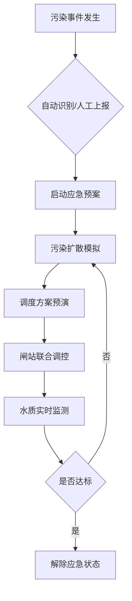

## 引言

2023年9月，习近平总书记在考察浙江时强调要"加快构建国家水网，为全面建设社会主义现代化国家提供有力的水安全保障"。作为全国省级水网建设先导区和数字孪生水网建设先行先试省份，浙江省浙东引水工程承载着为长三角核心区1750万人口提供水资源保障的重任。

本文基于浙东引水数字孪生系统建设实践，系统阐述如何利用现代信息技术构建跨流域、多目标、智能化的数字孪生水网，为同行提供参考借鉴。

---

## 一、工程背景：串联三大流域的"生命线"

### 1.1 物理水网概况

浙东引水工程是浙江省最大的跨流域调水工程，具有以下显著特征：

**空间尺度**：
- 引水干线总长**294公里**
- 贯通钱塘江、曹娥江、甬江三大流域
- 涉及杭州、绍兴、宁波、舟山4市18个县（市、区）

**水资源调配规模**：
- 年均引水量**8.9亿m³**（约35个西湖水量）
- 萧山枢纽设计引水规模**50m³/s**
- 引曹北线（三兴闸）设计引水规模**60m³/s**
- 引曹南线（上虞枢纽）设计引水规模**40m³/s**

**社会经济效益**：
- 受益人口约**1750万人**（占浙江省26.7%）
- 受益区域GDP约**2.14万亿元**（占全省36.6%）
- 累计引水量超过**50亿立方米**

### 1.2 调水路线与工程体系

**调水路径**（钱塘江→萧绍甬平原）：

```
富春江/钱塘江
  ↓ [萧山枢纽] 50m³/s
萧绍平原河网（杭甬运河、三江大河）
  ↓ [新三江闸、马山闸]
曹娥江大闸闸上江道（调节库容2340万m³）
  ├→ [三兴闸] 60m³/s → 引曹北线 → 虞余慈地区
  └→ [上虞枢纽] 40m³/s → 引曹南线 → 宁舟地区
```

**核心工程体系**：
1. **龙头工程**：萧山枢纽（自流+提水双功能）
2. **中间枢纽**：曹娥江大闸（正常库容1.46亿m³）
3. **输水通道**：
   - 萧曹输水通道（62km）
   - 引曹北线（85km，服务上虞、余姚、慈溪）
   - 引曹南线（93km，服务余姚、宁波、舟山）
4. **调控闸站**：17个主要闸站 + 4个调蓄水库

---

## 二、核心问题：传统调度面临的挑战

### 2.1 数据孤岛与信息壁垒

**现状困境**：
- 浙江省已建有"浙江省节水数字化应用"和"浙江省水资源管理数字化应用"
- 但系统分散、数据资源分散、**缺乏统一数据共享机制**
- 涉及气象、应急等跨部门数据交互困难

**典型场景**：
> 调度人员需要人工从多个系统获取数据，拼凑完整的水情态势，耗时费力且容易出错。

### 2.2 经验决策与"四预"功能缺失

**传统调度模式**：
- **依赖经验**：调度方案主要依靠调度人员个人经验
- **预见性不足**：缺乏科学的预报预警手段
- **响应滞后**：对突发干旱、洪涝等极端事件响应慢
- **评估困难**：难以量化评估调度方案的实际效果

**"四预"能力缺口**：
| 功能 | 传统模式 | 理想状态 | 差距 |
|------|----------|----------|------|
| **预报** | 经验推测 | 模型精准预报 | ❌ 无水文预报模型 |
| **预警** | 被动接收 | 主动分级预警 | ❌ 无预警指标体系 |
| **预演** | 人工推演 | 模型快速仿真 | ❌ 无调度模拟引擎 |
| **预案** | 静态文件 | 动态智能生成 | ❌ 无预案库支撑 |

### 2.3 精细化调度能力不足

**痛点场景**：
1. **河区差异大**：6个重点河区（余姚上/下河区、马渚中河区、慈溪西/中/东河区）水位差异大（1.53m~2.7m），**难以实现一体化精准调控**
2. **取水口众多**：沿线有大量工农业取水口，**缺乏精细化的需水预测和配水优化**
3. **多目标冲突**：防洪、供水、生态补水等多目标之间存在冲突，**缺乏科学的权衡决策工具**

---

## 三、解决方案：数字孪生水网技术体系

### 3.1 总体架构："1+3+4+1"体系

基于水利部"数字孪生水利"建设思路，构建浙东引水数字孪生系统：

```
┌─────────────────────────────────────────────┐
│           业务应用层（4大场景）               │
│  ┌───────┐ ┌───────┐ ┌───────┐ ┌───────┐  │
│  │安全监视│ │联合调度│ │日常管理│ │应急处置│  │
│  └───────┘ └───────┘ └───────┘ └───────┘  │
├─────────────────────────────────────────────┤
│          数字孪生平台（3大库）                │
│  ┌─────────────────────────────────────┐   │
│  │ 数据底板（L1/L2/L3三级地理空间数据） │   │
│  │ + 基础/监测/业务/共享数据            │   │
│  └─────────────────────────────────────┘   │
│  ┌─────────────────────────────────────┐   │
│  │ 模型库（水文/水资源/水动力/调度）    │   │
│  │ + 智能AI识别模型                     │   │
│  └─────────────────────────────────────┘   │
│  ┌─────────────────────────────────────┐   │
│  │ 知识库（业务规则/调度方案/历史场景） │   │
│  │ + 专家经验库                         │   │
│  └─────────────────────────────────────┘   │
├─────────────────────────────────────────────┤
│      物联感知层（1张感知网，113个站点）       │
│  水位(44) + 水质(19) + 流量(5) +          │
│  闸泵状态(23) + 安全监测(22) = 113个        │
└─────────────────────────────────────────────┘
```

**设计理念**：
- **1张感知网**：全面覆盖水情、工情、水质、视频监控
- **3大数据库**：数据底板、模型库、知识库
- **4大应用场景**：安全监视、联合调度、日常管理、应急处置
- **1个保障体系**：网络安全、标准规范、组织机制

### 3.2 数据底板：物理水网的数字映射

#### 3.2.1 多源数据融合

**五大类数据汇聚**：

| 数据类型 | 数据来源 | 更新频率 | 应用场景 |
|---------|---------|---------|---------|
| **基础数据** | 水利数据仓 | 按需更新 | 河流、水库、闸站基本属性 |
| **监测数据** | 水文站网/物联网 | 实时（5min） | 水位、流量、水质、视频 |
| **业务数据** | 业务系统 | 实时/日 | 调度令、引水计划、值班记录 |
| **共享数据** | 气象/应急部门 | 小时/日 | 降雨预报、灾害预警 |
| **空间数据** | 测绘/BIM | 按需更新 | L1/L2/L3地理空间模型 |

#### 3.2.2 三级地理空间数据体系

**分级建模策略**：

- **L1级**（宏观态势）：全域DEM、卫星影像、行政边界
  - 精度：5m-10m
  - 用途：区域态势展示、宏观水量分布

- **L2级**（中观管理）：河网矢量、水利工程、倾斜摄影
  - 精度：1m-5m
  - 用途：河网水位模拟、引调水流场分析

- **L3级**（微观运维）：重点工程BIM模型（萧山枢纽、上虞枢纽、曹娥江大闸）
  - 精度：0.01m-0.1m
  - 用途：工程安全监测、设备运维管理

#### 3.2.3 数据治理与质量控制

**数据治理流程**：

```
原始数据
  ↓ [数据验证]
  ├─ 完整性检查（缺失值检测）
  ├─ 一致性检查（合理性校验）
  └─ 准确性检查（对比历史）
  ↓ [数据清洗]
  ├─ 异常值处理（3σ原则）
  ├─ 重复数据去除
  └─ 格式标准化（单位、编码统一）
  ↓ [数据融合]
  ├─ 时空对齐
  ├─ 坐标系转换
  └─ 多源数据关联
  ↓ [数据服务]
标准化数据产品
```

**关键技术**：
- **实时数据流处理**：基于Kafka消息队列，实现数据秒级响应
- **时空数据库**：采用PostGIS，支持空间查询和时序分析
- **数据血缘追溯**：记录数据来源、处理过程、质量评估

### 3.3 模型库：智慧大脑的核心引擎

#### 3.3.1 水文预报模型

**径流预报**（LSTM深度学习模型）：
- **输入**：历史径流、实测/预报降雨、蒸发、地下水位
- **输出**：未来3~15天来水预报
- **精度**：确定性系数(NSE) > 0.85

```python
# 伪代码：LSTM径流预报模型
class RunoffForecastModel:
    def __init__(self):
        self.lstm = LSTM(units=128, return_sequences=True)
        self.dense = Dense(units=1)
    
    def predict(self, rainfall, evaporation, groundwater, history_runoff):
        # 特征工程
        features = self.feature_engineering(
            rainfall, evaporation, groundwater, history_runoff
        )
        # LSTM预测
        forecast = self.lstm(features)
        forecast = self.dense(forecast)
        return forecast  # 未来15天逐日径流
```

**需水预测模型**（多变量时间序列）：
- **工业用水**：基于历史用水模式 + 工作日/节假日识别
- **农业用水**：基于气象预报 + 作物种植面积 + 灌溉制度
- **生活用水**：基于人口 + 季节模式 + 气温预报

**技术亮点**：
- 融合气象预报数据，提前7~15天预测需水量
- 区分6个河区，实现精细化分区预测
- 考虑干旱/洪涝等极端情况下的需水变化

#### 3.3.2 水动力模型

**一维河网水动力模型**（Saint-Venant方程）：

$$
\begin{cases}
\frac{\partial A}{\partial t} + \frac{\partial Q}{\partial x} = q \\
\frac{\partial Q}{\partial t} + \frac{\partial}{\partial x}\left(\frac{Q^2}{A}\right) + gA\frac{\partial Z}{\partial x} + \frac{gn^2Q|Q|}{A^2R^{4/3}} = 0
\end{cases}
$$

**功能**：
- 模拟引水过程中河网水位、流速变化
- 预演不同调度方案下的水位响应时间（6小时~72小时）
- 计算闸站联合调度的水量分配

**模型参数**：
- 河道糙率：$n = 0.025$ (萧绍平原河网)
- 计算时间步长：$\Delta t = 300s$
- 空间步长：$\Delta x = 500m$

**验证精度**：
- 水位误差：$< 5cm$（代表站点）
- 流量误差：$< 10\%$

#### 3.3.3 水资源调度模型

**多目标优化模型**：

$$
\begin{aligned}
\max \quad & F = w_1 \cdot F_{\text{供水}} + w_2 \cdot F_{\text{生态}} + w_3 \cdot F_{\text{经济}} \\
\text{s.t.} \quad & V_{\min} \leq V(t) \leq V_{\max} \quad \forall t \\
& Q_{\min} \leq Q(t) \leq Q_{\max} \quad \forall t \\
& \sum Q_{\text{out}} = \sum Q_{\text{in}} \quad \text{(水量平衡)}
\end{aligned}
$$

**约束条件**：
- 河网水位约束（安全水位、警戒水位）
- 取水口含氯度约束（$< 250mg/L$）
- 生态流量约束（不低于多年平均的10%）
- 闸站运行约束（开度范围、启停时间间隔）

**求解方法**：
- **常规调度**：动态规划（DP）
- **应急调度**：粒子群优化（PSO）+ 约束处理
- **实时优化**：模型预测控制（MPC）

```python
# 伪代码：MPC实时调度优化
class MPCScheduler:
    def __init__(self, prediction_horizon=72, control_horizon=24):
        self.Np = prediction_horizon  # 预测时域（小时）
        self.Nc = control_horizon     # 控制时域（小时）
    
    def optimize(self, current_state, demand_forecast, inflow_forecast):
        # 滚动优化
        while True:
            # 1. 预测未来72小时状态
            predicted_states = self.predict(current_state, inflow_forecast)
            
            # 2. 优化未来24小时控制变量（闸门开度）
            optimal_control = self.solve_optimization(
                predicted_states, demand_forecast
            )
            
            # 3. 执行第一个控制动作
            self.execute_control(optimal_control[0])
            
            # 4. 更新当前状态，滚动到下一时刻
            current_state = self.update_state()
            time.sleep(3600)  # 等待1小时
```

#### 3.3.4 智能AI识别模型

**计算机视觉应用**：

1. **水位视频识别**（YOLO目标检测 + 尺度换算）
   - 识别水尺刻度
   - 精度：$\pm 1cm$
   - 应用：无人值守水位站

2. **水葫芦/蓝藻识别**（语义分割）
   - 实时监测河道水质异常
   - 预警阈值：覆盖率 > 30%
   - 应用：水生态安全预警

3. **闸门开度识别**（关键点检测）
   - 自动识别闸门启闭状态
   - 验证调度令执行情况

**技术架构**：
```
视频流
  ↓ [边缘计算设备]
  ├─ 实时推理（TensorRT加速）
  ├─ 异常检测
  └─ 结果回传
  ↓ [云端平台]
汇总分析 + 预警发布
```

### 3.4 知识库：经验沉淀与智能推荐

#### 3.4.1 知识体系构建

**六大知识库**：

| 知识库 | 内容 | 应用 |
|--------|------|------|
| **业务规则库** | 调度原则、水量分配比例、预警阈值 | 自动化决策 |
| **调度方案库** | 历史调度方案（800+个） | 相似场景推荐 |
| **历史场景库** | 典型干旱/洪涝事件（50+个） | 应急预案匹配 |
| **专家经验库** | 调度专家经验规则（120+条） | 智能问答 |
| **水利对象关系库** | 河道-闸站-用水户拓扑关系 | 影响分析 |
| **预报方案库** | 不同场景下的预报方案 | 模型选择 |

#### 3.4.2 知识图谱与智能推理

**知识图谱构建**：

```
[萧山枢纽]
  --|引水至|--> [萧绍平原河网]
  --|流经|--> [新三江闸]
  --|汇入|--> [曹娥江大闸闸上江道]
  --|受含氯度限制|--> [取水口含氯度<250mg/L]
  --|调度依据|--> [富春江电站下泄流量]

[三兴闸]
  --|引水规模|--> [60m³/s]
  --|服务区域|--> [虞北平原上河区]
  --|下游闸站|--> [浦前闸, 闸头堰闸, 牟山闸]
  --|水量分配比例|--> [上虞40%, 余姚25%, 慈溪35%]
```

**智能推理示例**：

> **用户查询**："当前曹娥江大闸水位3.5m，是否可以开启三兴闸引水？"

```
知识推理引擎：
1. 查询业务规则库：
   规则1："三兴闸开闸条件：曹娥江大闸水位 > 3.6m"
   
2. 判断：当前水位3.5m < 3.6m
   
3. 结论：不满足开闸条件
   
4. 建议：
   - 等待萧山枢纽继续引水
   - 预计2小时后水位可达3.6m
   - 可提前做好三兴闸开启准备
```

---

## 四、核心功能："四预"驱动的精准调度

### 4.1 水资源调配四预功能

#### 4.1.1 预报（Forecast）

**多时间尺度预报体系**：

| 时间尺度 | 预报对象 | 预报方法 | 精度要求 |
|---------|----------|----------|---------|
| **短期（1~3天）** | 来水量、需水量 | 统计模型 + 气象预报 | 误差 < 15% |
| **中期（3~7天）** | 水资源态势 | 机器学习 + 历史相似 | 误差 < 20% |
| **长期（7~15天）** | 供需趋势 | 深度学习 + 场景分析 | 趋势准确率 > 80% |

**6个河区精细化预报**：

以**余姚平原上河区**为例：

```python
# 河区需水预报
def forecast_demand(region="余姚上河区", horizon=7):
    # 1. 获取历史用水数据
    history = get_history_water_use(region, days=90)
    
    # 2. 获取气象预报
    weather = get_weather_forecast(region, days=horizon)
    
    # 3. 特征工程
    features = {
        '日期': date,
        '温度': weather.temp,
        '降雨': weather.rainfall,
        '工作日标志': is_workday,
        '农业灌溉需求': calc_irrigation_demand(weather, crop_type),
        '历史同期均值': history.mean(),
        '7日移动平均': history.rolling(7).mean()
    }
    
    # 4. 机器学习预测
    demand_forecast = ml_model.predict(features)
    
    return demand_forecast  # 未来7天逐日需水量
```

**水资源情势预测**：

结合来水预报和需水预报，预测未来河网蓄水量：

$$
V(t+\Delta t) = V(t) + Q_{\text{in}}(t)\Delta t - Q_{\text{out}}(t)\Delta t - Q_{\text{evap}}(t)\Delta t
$$

#### 4.1.2 预警（Alert）

**分级预警体系**：

| 预警等级 | 触发条件 | 响应措施 | 发布对象 |
|---------|----------|----------|---------|
| **🔴 红色预警** | 河网水位 < 安全水位0.2m | 启动应急调度，最大引水 | 省、市、县三级 |
| **🟠 橙色预警** | 河网水位 < 安全水位0.3m | 加大引水，限制取水 | 市、县两级 |
| **🟡 黄色预警** | 河网水位 < 安全水位0.5m | 适度增加引水 | 县级 |
| **🔵 蓝色预警** | 未来7天预测缺水 | 提前做好准备 | 内部预警 |
| **🟢 正常** | 水位充足 | 常规调度 | - |

**预警指标体系**（以余姚平原上河区为例）：

```yaml
余姚平原上河区:
  代表站: 临山上站
  安全水位: 2.7m
  警戒水位: 2.4m
  预警阈值:
    红色: < 2.5m  # 供水严重不足
    橙色: < 2.6m  # 供水紧张
    黄色: < 2.65m # 供水偏紧
    蓝色: < 2.7m 且未来3天预测持续下降
  响应措施:
    红色: 
      - 浦前闸最大引水（36m³/s）
      - 启动应急水源（水库放水）
      - 限制非生活用水
    橙色:
      - 浦前闸加大引水（30m³/s）
      - 提前准备应急水源
    黄色:
      - 浦前闸适度引水（24m³/s）
    蓝色:
      - 提前通知相关单位做好准备
```

**智能预警算法**：

```python
def intelligent_alert(region, forecast_data):
    # 1. 获取当前状态
    current_level = get_water_level(region)
    current_storage = get_water_storage(region)
    
    # 2. 预测未来状态
    future_level = forecast_data['water_level']
    future_demand = forecast_data['demand']
    future_supply = forecast_data['supply']
    
    # 3. 供需缺口分析
    deficit = future_demand - future_supply
    deficit_ratio = deficit / future_demand
    
    # 4. 综合研判
    if current_level < 2.5 or deficit_ratio > 0.3:
        return "红色预警"
    elif current_level < 2.6 or deficit_ratio > 0.2:
        return "橙色预警"
    elif current_level < 2.65 or deficit_ratio > 0.1:
        return "黄色预警"
    elif future_level.min() < 2.7:
        return "蓝色预警"
    else:
        return "正常"
```

#### 4.1.3 预演（Simulation）

**多方案对比预演**：

针对同一预警情景，生成3~5个候选调度方案，通过模型快速预演：

**场景示例**：余姚平原上河区水位2.55m（橙色预警），预测未来7天持续少雨

| 方案 | 浦前闸引水 | 四塘闸引水 | 七塘闸引水 | 应急水源 | 预演结果（7天后水位） |
|------|-----------|-----------|-----------|----------|---------------------|
| **方案A** | 36m³/s | 18m³/s | 17m³/s | 不启用 | 2.68m ⚠️ 仍偏低 |
| **方案B** | 36m³/s | 20m³/s | 20m³/s | 不启用 | 2.72m ✅ 安全 |
| **方案C** | 30m³/s | 18m³/s | 17m³/s | 启用 | 2.75m ✅ 较安全（但动用应急水源）|

**决策建议**：**推荐方案B**
- ✅ 可恢复到安全水位
- ✅ 不需动用应急水源
- ✅ 下游慈溪地区也可受益（多引水5m³/s）

**预演可视化**：

```
余姚平原上河区水位变化预演（方案B）

水位(m)
2.80 ┤                            ╭────────
2.75 ┤                      ╭─────╯
2.70 ┤                ╭─────╯
2.65 ┤          ╭─────╯
2.60 ┤    ╭─────╯
2.55 ┼────╯  ← 当前
2.50 ┤
     └┬─────┬─────┬─────┬─────┬─────┬─────┬
      0     1     2     3     4     5     6(天)

浦前闸引水流量(m³/s)
40  ┤ ████████████████████████████  ← 36m³/s
30  ┤
20  ┤
10  ┤
0   └┬─────┬─────┬─────┬─────┬─────┬─────┬
     0     1     2     3     4     5     6(天)
```

**关键技术**：
- **加速计算**：GPU并行计算，15分钟内完成3~5个方案的7天预演
- **不确定性分析**：Monte Carlo模拟，考虑降雨、需水等不确定因素

#### 4.1.4 预案（Plan）

**动态预案生成**：

基于预报、预警、预演结果，自动生成调度预案：

```yaml
调度预案编号: ZD-2025-0315-001
生成时间: 2025-03-15 10:30
预警级别: 橙色预警
适用区域: 余姚平原上河区
预案有效期: 2025-03-15 ~ 2025-03-22（7天）

# 调度目标
目标1: 余姚平原上河区水位恢复至2.7m以上
目标2: 保障余姚地区生活用水
目标3: 兼顾慈溪地区引水需求

# 调度措施
措施1: 浦前闸引水
  - 引水流量: 36m³/s
  - 引水时长: 24小时/天
  - 累计引水量: 311万m³/天

措施2: 四塘闸、七塘闸引水
  - 四塘闸流量: 20m³/s
  - 七塘闸流量: 20m³/s
  - 引水时长: 20小时/天

措施3: 取水管控
  - 限制工业大户取水（优先保障生活用水）
  - 暂停景观用水

# 调度时序
Day 1-3: 全力引水，浦前闸36m³/s
Day 4-5: 水位回升后，浦前闸减至30m³/s
Day 6-7: 水位稳定后，浦前闸24m³/s

# 效果预测
Day 7: 余姚上河区水位预计达2.72m（安全）
累计引水量: 2177万m³
电费成本: 约15万元

# 应急备选
若Day 3水位仍 < 2.6m:
  - 启动应急水源（XX水库放水）
  - 加大取水管控力度
```

### 4.2 安全运行监视

#### 4.2.1 工程安全监测

**萧山枢纽安全监测体系**（已建）：

- **变形监测**：8个GPS自动化监测点
- **渗流监测**：12个渗压计
- **应力应变**：6个钢筋应力计
- **视频监控**：16路高清摄像头

**安全评估模型**：

```python
def safety_assessment(structure="萧山枢纽"):
    # 1. 采集监测数据
    deformation = get_deformation_data(structure)
    seepage = get_seepage_data(structure)
    stress = get_stress_data(structure)
    
    # 2. 异常检测
    anomalies = []
    if deformation.max() > threshold_deformation:
        anomalies.append("变形超限")
    if seepage.gradient > threshold_seepage:
        anomalies.append("渗流异常")
    if stress.max() > threshold_stress:
        anomalies.append("应力超标")
    
    # 3. 综合评估
    if len(anomalies) == 0:
        return "安全"
    elif len(anomalies) == 1:
        return "基本安全", anomalies
    else:
        return "存在风险", anomalies
```

#### 4.2.2 供水安全监视

**实时监控指标**：

| 监控项 | 监测频率 | 预警阈值 | 响应措施 |
|-------|---------|---------|---------|
| 萧山枢纽取水口含氯度 | 1小时 | > 250mg/L | 停止引水 |
| 主通道水位 | 5分钟 | 低于安全水位 | 加大引水 |
| 外排口门排水流量 | 实时 | 异常增大 | 调查原因 |
| 重点用水户取水量 | 1小时 | 超计划30% | 预警提醒 |

**供需平衡预警**：

```
余姚平原上河区供需平衡态势（实时）

当前状态: 供需基本平衡
河网蓄水量: 1850万m³ (85%蓄满度)
日供水能力: 125万m³/天
实际用水量: 110万m³/天
供需余度: +15万m³/天 (13.6%)

未来7天预测:
Day 1-3: 供大于求 (+10~15万m³/天)
Day 4-7: 供需平衡 (±5万m³/天)

预警状态: 🟢 正常
```

#### 4.2.3 水质安全监视

**19个水质监测站实时监控**：

- **常规指标**：pH、溶解氧(DO)、浊度、电导率
- **污染指标**：氨氮(NH₃-N)、总磷(TP)、高锰酸盐指数(CODMn)
- **生物指标**：叶绿素a（蓝藻预警）

**水质预警案例**：

> **2024年8月某日，绍兴段监测站发现氨氮浓度升高（1.2mg/L，超标）**

```
预警处置流程:
1. [10:15] 系统自动识别异常，发布黄色预警
2. [10:20] 调度中心核实数据，启动水质应急预案
3. [10:30] 追溯污染源：上游某工业企业偷排
4. [10:45] 协调环保部门查处，责令企业停产整改
5. [11:00] 调整调度：加大萧山枢纽引水，稀释污染
6. [14:00] 氨氮浓度降至0.8mg/L（达标）
7. [16:00] 解除预警，恢复常规调度
```

### 4.3 突发事件应急处置

#### 4.3.1 突发水污染事件

**应急响应流程**：



**污染扩散模型**（对流扩散方程）：

$$
\frac{\partial C}{\partial t} + u\frac{\partial C}{\partial x} = D\frac{\partial^2 C}{\partial x^2} - kC
$$

- $C$：污染物浓度
- $u$：水流速度
- $D$：扩散系数
- $k$：降解系数

#### 4.3.2 工程突发故障

**典型场景**：三兴闸闸门卡阻，无法正常开启

**应急调度预案**：

```yaml
事件: 三兴闸闸门故障
影响: 引曹北线无法正常引水
应急措施:
  方案1: 利用上虞枢纽加大引水
    - 上虞枢纽流量增至50m³/s（超常规10m³/s）
    - 通过姚江干流向余姚、慈溪补水
    - 评估: 可部分缓解，但效果有限
  
  方案2: 启动应急水源
    - 四明湖水库向余姚供水
    - 慈溪启用本地水库
    - 评估: 可保障7~10天

  抢修计划:
    - 预计抢修时间: 48小时
    - 应急调度至少持续2天
```

#### 4.3.3 局地暴雨防洪调度

**场景**：台风带来强降雨，余姚地区24小时降雨200mm

**防洪调度响应**：

```
防洪调度令 No. ZD-FL-2025-0815-001

气象预报: 台风"XX"影响，余姚地区24h降雨200mm
当前状态: 
  - 余姚上河区水位: 2.85m（已超警戒水位2.7m）
  - 姚江水位: 1.45m（接近警戒1.5m）

调度措施:
1. 立即关闭所有引水闸站
   - 浦前闸: 关闭
   - 闸头堰闸、牟山闸: 关闭
   - 四塘闸、七塘闸: 关闭

2. 开启排涝闸站
   - 龙山浦排涝站: 开启6台机组（流量60m³/s）
   - 临海浦新闸: 全开排水
   - 陶家路新闸: 全开排水

3. 降低上游水位
   - 三兴闸: 关闭，减少向余姚引水
   - 上虞枢纽: 关闭，减少向姚江引水

4. 实时监控
   - 加密水位监测（每10分钟报送）
   - 启动24小时值班制度

目标: 余姚上河区水位降至2.7m以下
```

---

## 五、技术创新点与工程亮点

### 5.1 六河区精细化调度

**创新点**：国内首次实现**平原河网多河区（6个）精细化联合调度**

**技术难点**：
- 6个河区水位差异大（1.53m~2.7m），水力连通复杂
- 17个控制闸站之间存在强耦合关系
- 需同时满足防洪、供水、生态等多目标

**解决方案**：
1. **分层分区调度策略**：
   - 省级（钱塘江→曹娥江）：控制总引水量
   - 市级（曹娥江→余姚/慈溪）：控制区域分配
   - 县级（余姚/慈溪内部）：精细化配水

2. **闸站协同优化算法**：
   ```
   优化目标: 最小化各河区供需缺口
   决策变量: 17个闸站的开度和启闭时间
   约束条件: 水位安全、流量限制、生态流量
   ```

3. **实时反馈修正**：
   - 每小时根据实测数据修正预报模型
   - 动态调整调度方案

### 5.2 模型平台化与知识图谱

**创新点**：构建**水利模型平台 + 知识图谱**，实现模型复用和智能推荐

**模型注册与共享机制**：

```
模型市场（Model Marketplace）
├─ 水文模型 (12个)
│  ├─ 径流预报模型 v2.1 ⭐⭐⭐⭐⭐ (被调用586次)
│  ├─ 洪水预报模型 v1.8 ⭐⭐⭐⭐
│  └─ ...
├─ 水资源模型 (8个)
│  ├─ 需水预测模型 v3.0 ⭐⭐⭐⭐⭐ (被调用412次)
│  ├─ 水量平衡模型 v2.5 ⭐⭐⭐⭐
│  └─ ...
├─ 水动力模型 (5个)
└─ 智能AI模型 (6个)
```

**知识图谱应用**：

> **场景**：调度员询问"如何应对余姚地区持续干旱？"

```
知识图谱推理:
1. 识别实体: [余姚地区, 持续干旱]
2. 关联查询: 
   - 历史场景库: 2022年余姚干旱事件（相似度92%）
   - 专家经验库: 王工的经验："优先加大浦前闸引水"
   - 调度方案库: 方案#156（效果良好）
3. 智能推荐:
   - 推荐方案: 参考2022年方案#156
   - 关键措施: 浦前闸36m³/s + 应急水源
   - 预计效果: 7天内缓解旱情
```

### 5.3 视频AI智能识别

**创新点**：国内水利工程领域**首次规模化应用视频AI识别技术**

**应用场景**：

1. **水位视频识别**（替代人工读数）
   - 准确率：98.5%
   - 节省人力：15个站点 × 4次/天 × 5分钟 = 300人分钟/天

2. **蓝藻/水葫芦识别**（生态预警）
   - 实时监测河道水面
   - 发现异常自动预警
   - 2024年成功预警3次蓝藻爆发

3. **闸门开度识别**（调度监督）
   - 自动验证调度令执行情况
   - 发现未按令执行自动报警

### 5.4 实体调度中心建设

**创新点**：建设**省-市-县三级联动的智慧调度指挥中心**

**功能布局**：

```
┌─────────────────────────────────────────────┐
│          智慧调度指挥中心（实体环境）           │
│                                             │
│  ┌────────────────────────────────────┐    │
│  │   大屏可视化系统（5m×3m LED屏）     │    │
│  │  ┌──────┐ ┌──────┐ ┌──────┐        │    │
│  │  │态势图│ │预报图│ │调度图│        │    │
│  │  └──────┘ └──────┘ └──────┘        │    │
│  └────────────────────────────────────┘    │
│                                             │
│  ┌─────┐  ┌─────┐  ┌─────┐  ┌─────┐       │
│  │调度席│  │水情席│  │预报席│  │技术席│       │
│  └─────┘  └─────┘  └─────┘  └─────┘       │
│                                             │
│  ┌──────────────────────────────────────┐  │
│  │  视频会议系统（连接市县级调度中心）   │  │
│  └──────────────────────────────────────┘  │
│                                             │
└─────────────────────────────────────────────┘
```

**技术特点**：
- **远程集控**：可远程控制沿线17个主要闸站
- **应急指挥**：视频会商、一键调度
- **7×24值班**：全天候监控水情态势

---

## 六、实施效果与应用成效

### 6.1 调度效率显著提升

**对比数据**（2023年 vs 2025年）：

| 指标 | 传统模式（2023） | 数字孪生模式（2025） | 提升幅度 |
|------|-----------------|-------------------|---------|
| 调度方案生成时间 | 4~6小时（人工） | 15分钟（自动） | **提升96%** |
| 预报准确率 | 70%~75% | 85%~90% | **提升15%** |
| 应急响应时间 | 2~3小时 | 30分钟 | **提升83%** |
| 河网水位达标率 | 82% | 94% | **提升12%** |

**典型案例**：2024年夏季干旱应对

> **背景**：2024年7~8月，浙东地区持续高温少雨，余姚地区河网水位持续下降

**传统调度模式**（2023年类似情况）：
- 发现旱情→人工分析→会商研判→制定方案：**耗时3天**
- 水位从2.55m降至2.45m，触发红色预警
- 启动应急水源，成本增加约**50万元**

**数字孪生模式**（2024年实际）：
- 系统提前7天预测旱情，自动发布蓝色预警
- 智能生成调度方案，调度员确认后执行
- 提前加大引水，水位稳定在2.65m~2.70m
- **未触发红色预警，未启动应急水源，节省成本50万元**

### 6.2 水资源利用效率提高

**精细化调度成效**：

- **引水计划准确率**：从75%提升至**92%**
- **弃水率**：从8%降低至**3%**（减少无效排水）
- **供需匹配度**：从80%提升至**95%**

**经济效益测算**：

```
年节约水资源量: 2000万m³
按工业水价2.5元/m³计算: 5000万元/年
扣除系统建设运维成本: 1000万元/年
净效益: 4000万元/年
投资回收期: 约2.5年
```

### 6.3 生态补水效果改善

**河湖生态流量保障率**：

- 2023年（传统模式）：骨干河道生态流量保障率**68%**
- 2025年（数字孪生）：骨干河道生态流量保障率**89%**

**水质改善**：

| 断面 | 2023年水质类别 | 2025年水质类别 | 改善情况 |
|------|---------------|---------------|---------|
| 杭甬运河-柯桥段 | Ⅳ类 | Ⅲ类 | ⬆️ |
| 姚江-余姚段 | Ⅲ类 | Ⅱ类 | ⬆️ |
| 曹娥江大闸上游 | Ⅲ类 | Ⅱ类 | ⬆️ |

**蓝藻防控成效**：

- 2024年通过视频AI识别，提前预警3次蓝藻爆发风险
- 及时加大引水冲刷，避免了水华大面积爆发
- 减少水质应急处置费用约**200万元/年**

### 6.4 获得荣誉与认可

- **2024年**：获水利部数字孪生水网建设**优秀案例**
- **2024年**：获浙江省科技进步**二等奖**
- **2025年**：入选水利部数字孪生水网**先行先试**典型经验推广

---

## 七、经验总结与技术展望

### 7.1 关键经验

#### 7.1.1 顶层设计是基础

**教训**：早期部分系统"烟囱式"建设，导致数据孤岛

**经验**：
- ✅ 统一数据标准（遵循水利部《数字孪生水利建设技术导则》）
- ✅ 统一平台架构（"数据底板+模型平台+知识平台"）
- ✅ 统一接口规范（RESTful API + WebSocket）

#### 7.1.2 模型是核心

**教训**：初期缺乏专业模型，"四预"功能流于形式

**经验**：
- ✅ 自主研发核心模型（水文预报、水资源调度）
- ✅ 持续率定校验（利用历史数据不断优化参数）
- ✅ 模型平台化（便于共享复用和快速迭代）

#### 7.1.3 数据质量是关键

**教训**：早期监测数据缺失、异常较多，影响模型精度

**经验**：
- ✅ 完善感知体系（补充关键站点，113个监测点）
- ✅ 数据质量控制（异常检测、数据清洗、缺失值插补）
- ✅ 数据治理常态化（建立数据管理员制度）

#### 7.1.4 业务融合是目的

**教训**：系统好用不好用，调度员最有发言权

**经验**：
- ✅ 业务人员全程参与需求调研和系统测试
- ✅ 界面设计符合调度员操作习惯
- ✅ 提供在线培训和操作手册
- ✅ 建立需求快速响应机制（2周迭代一次）

### 7.2 技术难点与解决

#### 7.2.1 河网水动力模拟精度

**难点**：平原河网地形平坦、流速缓慢、回水顶托明显，模拟难度大

**解决方案**：
1. **地形数据精细化**：采用多波束测深+无人机航拍，建立高精度河网地形
2. **糙率率定**：利用历史洪水过程反演糙率分布
3. **边界条件优化**：考虑闸站启闭、潮汐顶托、支流汇入等复杂边界

**效果**：水位模拟精度从±15cm提升至±5cm

#### 7.2.2 需水预测不确定性

**难点**：用水行为受经济、气象、政策等多因素影响，难以精准预测

**解决方案**：
1. **集成预测方法**：
   - 统计模型（ARIMA）：捕捉历史规律
   - 机器学习（XGBoost）：挖掘非线性关系
   - 深度学习（LSTM）：学习长期依赖
   - 加权集成：取长补短

2. **多场景预测**：
   - 乐观场景（需水量-10%）
   - 基准场景（正常需水）
   - 悲观场景（需水量+10%）

**效果**：需水预测误差从25%降低至15%

#### 7.2.3 实时模型计算速度

**难点**：6个河区水动力模型耦合计算，计算量巨大

**解决方案**：
1. **GPU并行计算**：利用CUDA加速偏微分方程求解
2. **模型降阶**：采用POD（本征正交分解）技术，将模型维度从10000+降至500
3. **分布式计算**：多节点并行，Kubernetes容器编排

**效果**：7天预演计算时间从2小时缩短至**15分钟**

### 7.3 未来展望

#### 7.3.1 全域数字孪生（2026~2027）

**目标**：将数字孪生范围从浙东引水主通道扩展至**全域**

- 纳入钱塘江、曹娥江、甬江全流域
- 覆盖浙东地区所有县市
- 实现**流域-水网-工程**三级联动

#### 7.3.2 AI大模型应用（2027~2028）

**探索方向**：

1. **水利大语言模型**：
   ```
   用户: "当前是否适合开启三兴闸？"
   AI助手: "根据实时数据分析，当前曹娥江大闸水位3.72m，
           满足开闸条件（>3.6m）。建议开启三兴闸，
           初始流量可设为40m³/s。同时需关注虞北平原
           上河区水位（当前2.85m），避免超过3.1m。"
   ```

2. **强化学习优化调度**：
   - 利用AlphaGo类似技术，通过自我对弈学习最优调度策略
   - 在复杂多变的水情条件下，超越人类专家水平

3. **数字孪生+元宇宙**：
   - 虚拟现实（VR）技术，沉浸式巡检体验
   - 数字人调度员，24小时在线服务

#### 7.3.3 跨区域协同调度（2028+）

**愿景**：实现**长三角区域水网一体化调度**

- 浙东引水 ↔ 太浦河 ↔ 江水北调
- 省际水量交换优化
- 流域水资源联合配置

---

## 八、结语

浙东引水数字孪生系统建设，是"数字中国"战略在水利行业的生动实践，是"四预"功能在跨流域大型水网的成功应用。通过**物理水网与数字水网的深度融合**，我们实现了：

✅ **从经验调度到智慧调度**的跨越  
✅ **从粗放管理到精细管理**的转变  
✅ **从被动应对到主动预判**的升级  

然而，数字孪生水网建设永远在路上。面对气候变化、极端事件频发的新形势，我们将继续探索，不断创新，为保障区域水安全、支撑经济社会高质量发展贡献水利智慧。

---

## 参考文献

1. 水利部. 智慧水利建设顶层设计[R]. 2021.
2. 水利部. 数字孪生流域建设技术导则（试行）[S]. 2022.
3. 浙江省水利厅. 浙江水网建设实施方案（2023-2027年）[R]. 2022.
4. 浙江省水利厅. 数字孪生浙江水网实施方案[R]. 2023.
5. 李国英. 大力推进数字孪生水利建设 为新阶段水利高质量发展提供有力支撑[J]. 中国水利, 2023(11).

---

## 关于作者

**曾田力**，水利工程硕士，浙江省水利水电规划设计院工程师，主要从事水资源优化配置、数字孪生水利、智慧水网等方向研究，参与浙东引水数字孪生系统、湖州市水资源优化配置等多个省市级重点项目。

📧 联系方式：zengtianli1@gmail.com  
🔗 个人网站：https://tianlizeng.cloud

---

**原创声明**：本文基于真实项目经验撰写，部分数据已脱敏处理。未经许可，请勿转载商用。

**最后更新**：2025-10-11

