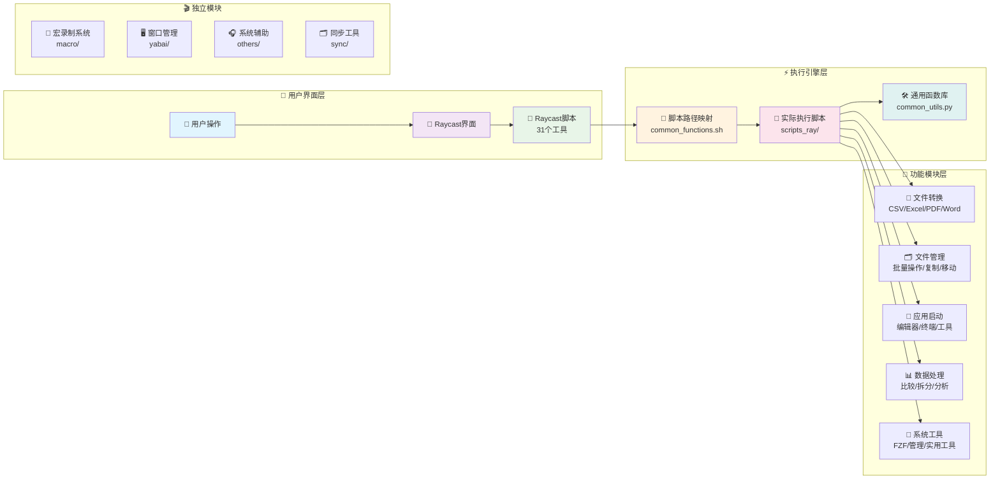

# 📖 Execute - macOS 效率工具集合

> 一套完整的 macOS 自动化工具集合，通过 Raycast 集成提供强大的文件处理、窗口管理、宏录制等功能，让你的 macOS 使用体验更加高效。

## 🚀 快速开始

```bash
# 1. 克隆项目
git clone https://github.com/zengtianli/execute
cd execute

# 2. 安装依赖
pip3 install -r scripts_ray/requirements.txt
brew install fzf pandoc

# 3. 配置Raycast
# 将 raycast/ 目录添加到 Raycast 扩展目录
# 在 Raycast 中刷新扩展列表

# 4. 开始使用
# 在 Finder 中选择文件，然后在 Raycast 中运行相应命令
```

## 💡 核心功能概览

### 🎯 6大功能模块

| 模块 | 功能描述 | 脚本数量 | 主要用途 |
|------|----------|----------|----------|
| 📱 **Raycast集成** | 文件处理、应用启动、数据转换 | 27+ | 日常效率工作 |
| 🖥️ **窗口管理** | Yabai配置、空间管理、窗口控制 | 8 | 桌面环境优化 |
| 🎬 **宏录制** | 操作录制、回放、管理 | 5 | 重复任务自动化 |
| 🔄 **文件处理** | 格式转换、数据处理、批量操作 | 20+ | 文档和数据工作 |
| 🎧 **系统辅助** | AirPods控制、语音识别、字幕 | 3 | 系统功能增强 |
| 🗂️ **同步备份** | 文件同步、配置管理 | 1 | 数据安全 |

### 🏗️ 系统架构

系统采用**分层架构设计**，实现了界面与逻辑的完美分离：



**双层架构优势**：
- **界面层**（raycast/）：负责用户交互和参数处理
- **执行层**（scripts_ray/）：负责核心业务逻辑实现
- **统一管理**：所有脚本路径在 `common_functions.sh` 中集中维护

## 📱 Raycast 集成工具

这是整个工具集的**核心功能**，通过 Raycast 提供统一的操作界面。

### 🎯 功能分类

#### 📄 应用程序启动（5个工具）
```bash
ray_app_cursor.sh          # 在当前目录启动 Cursor 编辑器  
ray_app_nvim_ghostty.sh    # 在 Ghostty 中用 Nvim 编辑文件
ray_app_ghostty.sh         # 在当前目录启动 Ghostty 终端
ray_app_terminal.sh        # 在当前目录启动默认终端
ray_app_windsurf.sh        # 在当前目录启动 Windsurf 编辑器
```

#### 📁 文件和文件夹管理（8个工具）
```bash
ray_copy_filename.sh       # 复制文件名到剪贴板
ray_copy_name_content.sh   # 复制文件名和内容到剪贴板
ray_folder_create.sh       # 在当前位置创建新文件夹
ray_folder_move_up_remove.sh  # 移动文件夹内容到上级目录
ray_folder_add_prefix.sh   # 为文件添加文件夹名前缀
ray_file_run_single.sh     # 运行单个脚本文件
ray_file_run_parallel.sh   # 并行运行多个脚本文件
ray_folder_paste_simple.sh # 简单粘贴操作
```

#### 🔄 格式转换工具（12个工具）
```bash
# CSV 相关转换
ray_csv_to_txt.sh          # CSV 转 TXT
ray_csv_to_xlsx.sh         # CSV 转 Excel
ray_txt_to_csv.sh          # TXT 转 CSV  
ray_xlsx_to_csv.sh         # Excel 转 CSV

# Office 文档转换
ray_docx_to_md.sh          # DOCX 转 Markdown
ray_doc_to_docx.sh         # DOC 转 DOCX
ray_pdf_to_md.sh           # PDF 转 Markdown
ray_ppt_to_md.sh           # PPT 转 Markdown

# Excel 相关
ray_txt_to_xlsx.sh         # TXT 转 Excel
ray_xlsx_to_txt.sh         # Excel 转 TXT
ray_xls_to_xlsx.sh         # XLS 转 XLSX
ray_md_to_docx.sh          # Markdown 转 DOCX
```

### 💼 实际使用案例

#### 案例1: 批量转换Office文档
```bash
# 1. 在Finder中选择多个DOCX文件
# 2. 在Raycast中运行: ray_docx_to_md.sh
# 3. 系统自动将所有DOCX转换为Markdown格式
# 4. 显示处理统计: "已处理 5/5 个文件，跳过 0 个"
```

#### 案例2: 开发环境快速启动
```bash
# 1. 在Finder中打开项目目录
# 2. 在Raycast中运行: ray_app_cursor.sh（启动Cursor）
# 3. 在Raycast中运行: ray_app_ghostty.sh（启动终端）
# 4. 在Raycast中运行: ray_app_nvim_ghostty.sh（用Nvim编辑文件）
# 结果: 完整的开发环境在几秒内就绪
```

## 🖥️ 窗口管理系统

基于 **Yabai** 的精简高效窗口管理配置，提供核心窗口操作功能。

### 📁 配置结构

```
yabai/
├── config/                 # 配置文件（4个）
│   ├── yabairc            # 主配置文件
│   ├── apps.conf          # 应用规则配置
│   ├── spaces.conf        # 空间配置
│   └── indicator.conf     # 指示器配置
└── scripts/               # 功能脚本（8个）
    ├── service/toggle.sh  # 服务控制：启动/停止/重启
    ├── window/           # 窗口管理（3个脚本）
    │   ├── resize.sh     # 窗口大小调整
    │   ├── move.sh       # 窗口移动
    │   └── float.sh      # 浮动/平铺切换
    └── space/            # 空间管理（2个脚本）
        ├── create.sh     # 创建空间
        └── navigate.sh   # 空间导航
```

## ⚙️ 安装配置指南

### 🛠️ 系统要求

- **macOS**: 10.14+ (推荐 macOS 12+)
- **Raycast**: 最新版本
- **Python**: 3.8+ (通过miniforge3安装)
- **终端**: Ghostty (推荐) 或默认终端

### 📦 依赖安装

#### 1. 基础环境
```bash
# 安装 Homebrew
/bin/bash -c "$(curl -fsSL https://raw.githubusercontent.com/Homebrew/install/HEAD/install.sh)"

# 安装 Python 环境
brew install miniforge
conda init zsh  # 或 bash

# 安装系统工具
brew install fzf pandoc
brew install --cask libreoffice
```

#### 2. Python 依赖
```bash
# 进入项目目录
cd execute

# 安装 Python 包
pip3 install -r scripts_ray/requirements.txt
```

## 🤝 贡献指南

欢迎提交 Issue 和 Pull Request！

### 📋 开发规范
- 遵循项目的代码风格和命名约定
- 所有新脚本必须包含错误处理机制
- 更新相关文档和映射关系表
- 添加适当的测试用例

### 📄 许可证

本项目采用 [MIT License](LICENSE)

---

**🚀 让 macOS 使用更高效！**

如果这个工具集对你有帮助，请给个 ⭐️ 支持一下！
